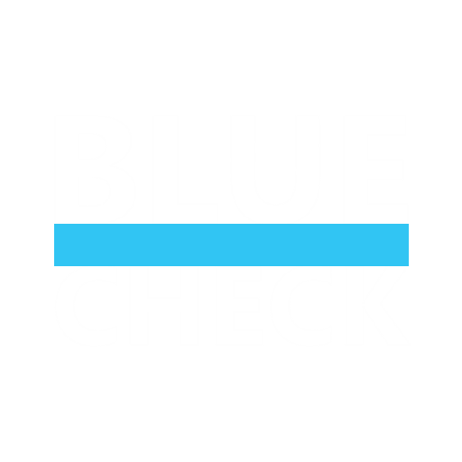

# BLUE CHECK - 딥페이크 탐지 안드로이드 애플리케이션

<div align="center">
  
  <br>
  
  [](README.md) [](README.kr.md)
</div>

## 📖 개요
Blue Check는 YOLO 객체 감지 모델과 ONNX 런타임 기반의 딥러닝 모델을 활용해 이미지 내 딥페이크를 탐지하는 안드로이드 앱입니다.  
Jetpack Compose로 구현된 현대적 UI와 실시간 분석 기능을 제공합니다.

## 🎬 데모
<div align="center">
  <a href="https://youtu.be/O3X-rWDxpi8">
    
  </a>
</div>

## ✨ 주요 기능
- **Deepfake 탐지**:
  - 업로드된 이미지에서 얼굴을 검출하고 Deepfake 여부 분석
- **인증마크 부여**:
  - 실제 사진(Real) 판정 시 인증 마크 추가 및 갤러리 저장
- **이미지 업로드 지원**:
  - 기기 갤러리에서 사진 선택 또는 URL을 통한 이미지 입력
- **직관적인 UI**:
  - Jetpack Compose 기반의 사용자 친화적인 인터페이스

## 🛠 기술 스택
| 분류 | 기술 |
|------|------|
| 언어 | Kotlin 1.9+ |
| UI | Jetpack Compose Material3 |
| ML | ONNX Runtime 1.16+ / YOLOv11 |
| 비동기 | Kotlin Coroutine |
| 이미지 | Coil 2.5+ |
| 애니메이션 | Lottie 6.1+ |

## 🧠 AI 모델 아키텍처
| 구성 요소 | 설명 |
|----------|------|
| 얼굴 검출 | 모바일 최적화된 YOLOv11n 얼굴 검출 모델 |
| 딥페이크 분류기 | Early Exit 적용 이진 분류 CNN (정확도 97.5%) |
| 모델 포맷 | 크로스 플랫폼 호환성 및 하드웨어 가속을 위한 ONNX |
| 입력 크기 | 분류 모델 128x128px, 얼굴 검출 640x640px |
| 최적화 | Int8 양자화, 메모리 최적화, 추론 캐싱 |

## 📊 성능 최적화
- **모델 양자화**: Int8 양자화로 모델 크기 약 70% 감소, 정확도 손실 최소화
- **추론 최적화**: 
  - 메모리 버퍼 재사용 및 커스텀 전처리 파이프라인
  - Kotlin Coroutines를 활용한 비동기 처리
  - 가능한 경우 GPU 위임
- **런타임 캐싱**: 모델 및 추론 결과 캐싱으로 반복 계산 감소
- **성능 모니터링**: 실시간 메모리 및 CPU 사용량 추적과 자동 최적화

## 🚀 시작하기
### 전제 조건
- Android Studio Giraffe 이상
- Android SDK 34 (API 34)

### 설치 방법
저장소 복제:
```bash
git clone https://github.com/wintrover/DeepFakeDetectApp.git
```

### 앱 실행
- Android Studio에서 프로젝트 열기
- 물리 기기 또는 에뮬레이터에서 빌드 및 실행

## 🖥 사용 방법
1. **이미지 업로드**
   - [이미지 선택] 버튼: 로컬 갤러리 접근
   - [이미지 주소 입력] 버튼: 웹 이미지 URL 입력
2. **탐지 과정**
   - 앱이 자동으로 이미지의 딥페이크 여부 분석
   - 결과가 신뢰도 점수와 함께 표시됨
3. **인증 마크 추가**
   - Real 판정 시 [인증마크] 버튼 활성화 → 갤러리에 저장

## 📁 프로젝트 구조
```bash
.
├── app
│   ├── src/main
│   │   ├── java/com/garam/cvproject
│   │   │   ├── DeepfakeDetector.kt  # AI 모델 핸들러
│   │   │   ├── ModelOptimizer.kt    # 추론 최적화
│   │   │   ├── ModelQuantizer.kt    # 모델 압축
│   │   │   ├── PerformanceMonitor.kt # 런타임 측정
│   │   │   └── MainActivity.kt      # 컴포즈 UI 메인
│   │   ├── res
│   │   │   ├── drawable           # 벡터 애셋
│   │   │   └── mipmap             # 런처 아이콘
│   │   └── assets                 # ONNX 모델 파일
│   │      ├── yolov11n-face.onnx # 얼굴 검출
│   │      └── deepfake_binary_s128_e5_early.onnx # 딥페이크 분류
└── build.gradle                   # 종속성 관리
```

## 📄 라이선스
MIT License  
모델 파일 및 학습 데이터는 별도 라이선스가 적용될 수 있습니다.
- 기타사항
  - XML: snake_case 네이밍
  - 컴포즈: Material3 디자인 가이드라인 적용
  - Kotlin: Android Kotlin Style Guide 준수
    
## 🤝 팀
팀 이름: CloseAI

| 역할 | 이름 |
|------|------|
| 기획 및 총괄 | 이승헌 |
| AI모델 개발 | 윤수혁 |
| 앱 제작 | 김가람 |
| UI/UX 디자인 | 김소연 |

## 📬 연락처
문의 사항은 다음 주소로 연락주세요:  
wintrover@gmail.com
